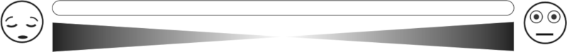

---


## Vorbereitung 

```{r setup, include = FALSE, warning = FALSE, message = FALSE}

## Fuer Umlaute benutzen: 
  # &uuml;  wird zu ue
  # &ouml; wird zu oe
  # &auml; wird zu ae

## Environment leeren
  rm(list = ls())
  
## Lade packages 
    
  #install.packages("dplyr")  
  #install.packages("ggplot2") 
  #install.packages("ggstatsplot") 
  #install.packages("grid")
  #install.packages("png")
  #install.packages("reshape")
  #install.packages ("sjPlot")
  #install.packages("tidyverse")
  #install.packages("data.table")
  #install.packages("Rmisc")
    
  library(dplyr)
  library(ggplot2)
  library(ggstatsplot)
  library(grid)
  library(png)
  library(reshape)
  library(sjPlot)
  library(tidyverse)
  library(data.table)
  library(Rmisc)
```

```{r Daten_laden, warning = FALSE}

# Importiere CSV Datei mit UTF-8 encoding, Spaltentrenner ; und Dezimalzeichen ,
ds = read.csv("Eltern_Kind_Befragung_Roboter_Interaktion.csv", encoding = "UTF-8",header = TRUE,sep = ";",dec = ",",
    row.names = "CASE",as.is = TRUE,check.names = TRUE, fill = TRUE, strip.white = TRUE)

# Lade Screening Datenset fuer Information zu Alter / Geschlecht
screen = readRDS("Traits_screening", refhook = NULL)

# Fuege das Screening-Datenset dem ds-Datenset hinzu
ds <- merge(ds,screen, all = T)

# Frageboegen getrennt auswerten
# Eltern_uebung
ds_uebung = ds %>% dplyr::filter(QUESTNNR=='Eltern_Uebung')
ds_uebung <- as.data.table(ds_uebung)
ds_uebung[,EXC_NR := as.factor(EXC_NR)]

# Zunaechst nur die Daten der ID "testtest" verwenden
#ds_uebung <- ds_uebung[PID == "testtest",]

# Eltern_full, kids_full
ds = ds %>% dplyr::filter(QUESTNNR=='Eltern_full' | QUESTNNR=='Kinder_full')

# Nur abgeschlossene Eintraege beruecksichtigen (FINISHED sollte Wert 1 haben)
ds = ds %>% dplyr::filter(as.logical(FINISHED))

# Nur Einträge mit eindeutiger Gruppe berücksichtigen
ds = ds %>% dplyr::filter(ID03 == "1" | ID03 == "2")

# Zeige Anzahl der TeilnehmerInnen
show(paste("Anzahl Kinder:", length(unique(ds$PID))))

```

Zun&auml;chst werden die Datensets "Kinder_full", "Eltern_full" und "Eltern_Uebung" aus soscisurvey geladen und &uuml;berpr&uuml;ft, wie viele Probanden gemessen wurden und wie die Verteilung auf die Gruppen (Avatar vs Roboter) aussieht.

```{r Gruppenverteilung}

# Dieser Faktor gibt an, ob der Teilnehmer mit Roboter oder Tablet interagierte

ds_robbie = ds %>% dplyr::filter(QUESTNNR=='Kinder_full')

ds_robbie$TABLET_ROBOT = factor(
  ds_robbie$ID03,
  levels = c("1", "2"),
  labels = c("Roboter", "Avatar"),
  ordered = FALSE
)
summary(ds_robbie$TABLET_ROBOT)
```

```{r pr_kind_eltern_rating}
# Waehle Kinder-Fragebogen aus
  ds_kind = ds %>% dplyr::filter(QUESTNNR=='Kinder_full') %>%
  
# Nur abgeschlossene Eintraege beruecksichtigen (FINISHED sollte Wert 1 haben)
  dplyr::filter(as.logical(FINISHED))

# Master-Table fuer Kind-Fragebogen Roboter-Interaktion
  int_kind = data.frame(ds_kind$PID)
  colnames(int_kind ) = "ID"

# Gruppenrecodierung: Avatar vs Roboter
  int_kind$group = ds_kind$ID03
  int_kind$group [int_kind$group  == 1] = "Roboter"
  int_kind$group [int_kind$group  == 2] = "Avatar"
  
# Waehle Eltern-Fragebogen aus
  ds_eltern = ds %>% dplyr::filter(QUESTNNR=='Eltern_full') %>%
  
# Nur abgeschlossene Eintraege beruecksichtigen (FINISHED sollte Wert 1 haben)
  dplyr::filter(as.logical(FINISHED))

# Master-Table fuer eltern-Fragebogen Roboter-Interaktion
  int_eltern = data.frame(ds_eltern$PID)
  colnames(int_eltern ) = "ID"

# Gruppenrecodierung: Avatar vs Roboter
  int_eltern$group = ds_eltern$ID03
  int_eltern$group [int_eltern$group  == 1] = "Roboter"
  int_eltern$group [int_eltern$group  == 2] = "Avatar"
  
```

<br>

## Vor der Interaktion

<br>

**Hast du schon einmal mit einem Roboter gespielt?**

```{r roboter_kennen}
# reference: https://strengejacke.github.io/sjPlot/reference/plot_likert.html

# Fuege Items zu Master-Table fuer Kinderbefragung hinzu
  int_kind$robot_kenn = ds_kind$RB_ERFAHRUNG
  
# Waehle nur dieses Items aus  
  int_kind_er = as_tibble(int_kind)
  int_kind_er = int_kind_er %>% dplyr::select(robot_kenn)

# Kodiere Item um, definiere levels, faktorisiere und ordne sie
  int_kind_er = data.frame(lapply(int_kind_er, factor, ordered=TRUE, 
                          levels=1:2, 
                          labels=c("Ja","Nein")))
  
# Plotte Likert-Skala fuer Items getrennt nach Roboter- und Avatar-Gruppe
  plot_likert(int_kind_er, catcount = 2)
```

<br>

**Wie aufgeregt bist du? / Wie f&uuml;hlst du dich?**

Hier werden die Probanden mithilfe eines **Affective Sliders** gefragt, wie aufgeregt sie sind und wie sie sich f&uuml;hlen: <br> 

**Slider Valenz:**


<br>

**Slider Arousal**



<br>

```{r Aufregung & Valenz}
  ## Variable F_AROUSAL und F_VALENZ
  ds_kind <- as.data.table(ds_kind)
  ds_kind[,.(Mittelwert_Arousal = round(mean(F_AROUSAL,na.rm = TRUE),2),Mittelwert_Valenz = round(mean(F_VALENZ,na.rm = TRUE),2))]
  ds_kind <- as.data.frame(ds_kind)
```

## Pers&ouml;nlichkeit Robbie

Zur Einsch&auml;tzung von Robbies Pers&ouml;nlichkeit arbeiten wir mit Items der **Godspeed-Skala** mit den Subskalen: 

  + Sympathie
  + Intelligenz und 
  + Antropomorphismus.

Die mit Nummern gekennzeichneten Items "GDSPD" stellen die Einzelitems dar, die darunter zu den Skalen zusammengefasst wurden. **Abbildung A** zeigt die Einsch&auml;tzung von Robbies Pers&ouml;nlichkeit beim Roboter und **Abbildung B** beim Avatar. 


```{r Prep_Goodspeed}

# Berechnen der Skalenwerte von Mittelwerten der dazugehoerigen Items
  ds_kind$GDSPD_ANTHROMORPHISM = rowMeans(ds_kind[c("GDSPD01", "GDSPD02", "GDSPD03", "GDSPD04")], na.rm = T)
  ds_kind$GDSPD_LIKABILITY = rowMeans(ds_kind[c("GDSPD05", "GDSPD06", "GDSPD07", "GDSPD08")], na.rm = T)
  ds_kind$GDSPD_INTELLIGENCE = rowMeans(ds_kind[c("GDSPD10")], na.rm = T)

# Zuordnen der entsprechenden Extrema-Beschriftungen
  attr(ds_kind$GDSPD01,"1") = "Wie eine Maschine"
  attr(ds_kind$GDSPD01,"101") = "Wie ein Mensch"
  attr(ds_kind$GDSPD02,"1") = "Unecht"
  attr(ds_kind$GDSPD02,"101") = "Natuerlich"
  attr(ds_kind$GDSPD03,"1") = "Kuenstlich"
  attr(ds_kind$GDSPD03,"101") = "Realistisch"
  attr(ds_kind$GDSPD04,"1") = "Steif beim Bewegen"
  attr(ds_kind$GDSPD04,"101") = "Fluessig beim Bewegen"
  attr(ds_kind$GDSPD05,"1") = "Unfreundlich"
  attr(ds_kind$GDSPD05,"101") = "Freundlich"
  attr(ds_kind$GDSPD06,"1") = "Unangenehm"
  attr(ds_kind$GDSPD06,"101") = "Angenehm"
  attr(ds_kind$GDSPD07,"1") = "Unhoeflich"
  attr(ds_kind$GDSPD07,"101") = "Hoeflich"
  attr(ds_kind$GDSPD08,"1") = "Furchtbar"
  attr(ds_kind$GDSPD08,"101") = "Nett"
  attr(ds_kind$GDSPD10,"1") = "Dumm"
  attr(ds_kind$GDSPD10,"101") = "Klug"
  
# Aufteilen in Kind- und Eltern-Rating
  int_kind$GDSPD01 = ds_kind$GDSPD01
  int_kind$GDSPD02 = ds_kind$GDSPD02
  int_kind$GDSPD03 = ds_kind$GDSPD03
  int_kind$GDSPD04 = ds_kind$GDSPD04
  int_kind$GDSPD05 = ds_kind$GDSPD05
  int_kind$GDSPD06 = ds_kind$GDSPD06
  int_kind$GDSPD07 = ds_kind$GDSPD07
  int_kind$GDSPD08 = ds_kind$GDSPD08
  int_kind$GDSPD10 = ds_kind$GDSPD10
  int_kind$GDSPD_ANTHROMORPHISM  = ds_kind$GDSPD_ANTHROMORPHISM
  int_kind$GDSPD_LIKABILITY = ds_kind$GDSPD_LIKABILITY 
  int_kind$GDSPD_INTELLIGENCE = ds_kind$GDSPD_INTELLIGENCE
  
  
  # Berechnen der Skalenwerte von Mittelwerten der dazugeh?rigen Items
  ds_eltern$GDSPD_ANTHROMORPHISM = rowMeans(ds_eltern[c("GDSPD01", "GDSPD02", "GDSPD03", "GDSPD04")], na.rm = T)
  ds_eltern$GDSPD_LIKABILITY = rowMeans(ds_eltern[c("GDSPD05", "GDSPD06", "GDSPD07", "GDSPD08")], na.rm = T)
  ds_eltern$GDSPD_INTELLIGENCE = rowMeans(ds_eltern[c("GDSPD10")], na.rm = T)

# Zuordnen der entsprechenden Extrema-Beschriftungen
  attr(ds_eltern$GDSPD01,"1") = "Wie eine Maschine"
  attr(ds_eltern$GDSPD01,"101") = "Wie ein Mensch"
  attr(ds_eltern$GDSPD02,"1") = "Unecht"
  attr(ds_eltern$GDSPD02,"101") = "Natuerlich"
  attr(ds_eltern$GDSPD03,"1") = "Kuenstlich"
  attr(ds_eltern$GDSPD03,"101") = "Realistisch"
  attr(ds_eltern$GDSPD04,"1") = "Steif beim Bewegen"
  attr(ds_eltern$GDSPD04,"101") = "Fluessig beim Bewegen"
  attr(ds_eltern$GDSPD05,"1") = "Unfreundlich"
  attr(ds_eltern$GDSPD05,"101") = "Freundlich"
  attr(ds_eltern$GDSPD06,"1") = "Unangenehm"
  attr(ds_eltern$GDSPD06,"101") = "Angenehm"
  attr(ds_eltern$GDSPD07,"1") = "Unhoeflich"
  attr(ds_eltern$GDSPD07,"101") = "Hoeflich"
  attr(ds_eltern$GDSPD08,"1") = "Furchtbar"
  attr(ds_eltern$GDSPD08,"101") = "Nett"
  attr(ds_eltern$GDSPD10,"1") = "Dumm"
  attr(ds_eltern$GDSPD10,"101") = "Klug"
  
# Aufteilen in Kind- und Eltern-Rating
  int_eltern$GDSPD01 = ds_eltern$GDSPD01
  int_eltern$GDSPD02 = ds_eltern$GDSPD02
  int_eltern$GDSPD03 = ds_eltern$GDSPD03
  int_eltern$GDSPD04 = ds_eltern$GDSPD04
  int_eltern$GDSPD05 = ds_eltern$GDSPD05
  int_eltern$GDSPD06 = ds_eltern$GDSPD06
  int_eltern$GDSPD07 = ds_eltern$GDSPD07
  int_eltern$GDSPD08 = ds_eltern$GDSPD08
  int_eltern$GDSPD10 = ds_eltern$GDSPD10
  int_eltern$GDSPD_ANTHROMORPHISM  = ds_eltern$GDSPD_ANTHROMORPHISM
  int_eltern$GDSPD_LIKABILITY = ds_eltern$GDSPD_LIKABILITY 
  int_eltern$GDSPD_INTELLIGENCE = ds_eltern$GDSPD_INTELLIGENCE

```

**Einsch&auml;tzung der Kinder**

```{r Kind_Godspeed_Violin, warning = FALSE}

# Separieren in Avatar- und Roboter-Gruppe
  robot_gdspd_kind = int_kind[int_kind$group == "Roboter",]
  avatar_gdspd_kind = int_kind[int_kind$group == "Avatar",]
  
# Zeichne Violin-Plot
  robo_kind_gdspd = robot_gdspd_kind[grep("GDSPD", colnames(robot_gdspd_kind ))] %>% tidyr::gather() %>% ggplot(aes(y=value, x=key, fill = key, color = key))+
  geom_violin(draw_quantiles = 0.5)+
  scale_color_manual(values=c("gray32","gray32","gray32","gray32","gray32",
                              "gray32","gray32","gray32","gray32","gray32","gray32","gray32"))+
  scale_fill_manual(values=c("#B3238B","#FFE25D","#2886B3","#FF8FDF","#FF8FDF","#FF8FDF","#FF8FDF",
                             "#8FDBFF","#8FDBFF","#8FDBFF","#8FDBFF","#FFE25D"))+
  theme(legend.position = "none")+
  coord_flip()+
  ylab("Rating 0-100 %")+
  xlab("Item")
  
# Zeichne Violin-Plot
  avatar_kind_gdspd = avatar_gdspd_kind[grep("GDSPD", colnames(avatar_gdspd_kind ))] %>% tidyr::gather() %>% ggplot(aes(y=value, x=key, fill = key, color = key))+
  geom_violin(draw_quantiles = 0.5)+
  scale_color_manual(values=c("gray32","gray32","gray32","gray32","gray32",
                              "gray32","gray32","gray32","gray32","gray32","gray32","gray32"))+
  scale_fill_manual(values=c("#B3238B","#FFE25D","#2886B3","#FF8FDF","#FF8FDF","#FF8FDF","#FF8FDF",
                             "#8FDBFF","#8FDBFF","#8FDBFF","#8FDBFF","#FFE25D"))+
  theme(legend.position = "none")+
  coord_flip()+
  ylab("Rating 0-100 %")+
  xlab("Item")
  
  
  combine_plots(robo_kind_gdspd, avatar_kind_gdspd,
                               ncol = 2, nrow=1,
                               labels = c("A", "B"),
                               caption.color = "black")
  
```

**Einsch&auml;tzung der Eltern**

```{r Eltern_Godspeed_Violin, warning = FALSE}

# Separieren in Avatar- und Roboter-Gruppe
  robot_gdspd_eltern = int_eltern[int_eltern$group == "Roboter",]
  avatar_gdspd_eltern = int_eltern[int_eltern$group == "Avatar",]
  
# Zeichne Violin-Plot
  robo_eltern_gdspd = robot_gdspd_eltern[grep("GDSPD", colnames(robot_gdspd_eltern ))] %>% tidyr::gather() %>% ggplot(aes(y=value, x=key, fill = key, color = key))+
  geom_violin(draw_quantiles = 0.5)+
  scale_color_manual(values=c("gray32","gray32","gray32","gray32","gray32",
                              "gray32","gray32","gray32","gray32","gray32","gray32","gray32"))+
  scale_fill_manual(values=c("#B3238B","#FFE25D","#2886B3","#FF8FDF","#FF8FDF","#FF8FDF","#FF8FDF",
                             "#8FDBFF","#8FDBFF","#8FDBFF","#8FDBFF","#FFE25D"))+
  theme(legend.position = "none")+
  coord_flip()+
  ylab("Rating 0-100 %")+
  xlab("Item")

# Zeichne Violin-Plot
  avatar_eltern_gdspd = avatar_gdspd_eltern[grep("GDSPD", colnames(avatar_gdspd_eltern ))] %>% tidyr::gather() %>% ggplot(aes(y=value, x=key, fill = key, color = key))+
  geom_violin(draw_quantiles = 0.5)+
  scale_color_manual(values=c("gray32","gray32","gray32","gray32","gray32",
                              "gray32","gray32","gray32","gray32","gray32","gray32","gray32"))+
  scale_fill_manual(values=c("#B3238B","#FFE25D","#2886B3","#FF8FDF","#FF8FDF","#FF8FDF","#FF8FDF",
                             "#8FDBFF","#8FDBFF","#8FDBFF","#8FDBFF","#FFE25D"))+
  theme(legend.position = "none")+
  coord_flip()+
  ylab("Rating 0-100 %")+
  xlab("Item")
  
  
  combine_plots(robo_eltern_gdspd, avatar_eltern_gdspd,
                               ncol = 2, nrow=1,
                               labels = c("A", "B"),
                               caption.color = "black")
  
```

<br>

*Wir k&ouml;nnten an dieser Stelle statistische Vergleiche rechnen, ob Kinder / Eltern Robbie menschlicher / netter / kl&uuml;ger als Roboter im Vergleich zum Avatar fanden.* 

<br>

## Beziehung zu Robbie

<br>

### Integration of Others in the Self (IOS)

Mittels eines Venn-Diagramms haben die Probanden ihre gef&uuml;hlte N&auml;he zu Robbie mithilfe der **IOS-Skala** bewertet. Die Grafiken zeigten entweder einen Jungen oder ein M&auml;dchen als Avatar des Probanden:


```{r IOS_Bild, out.width=c('50%','50%'), fig.show='hold', echo = FALSE, warning = FALSE}

img = readPNG("IOS_scale.png")
grid.raster(img)

``` 


```{r IOS, warning = FALSE}
# Es gibt zwei Versionen des IOS (fuer Maedchen vs Jungen)in SocsciSurvey.
# Fuer jedes Kind existiert aber hoechstens ein Rating, weshalb das Rating fuer IOS_F uebernommen wird,
# falls IOS_M keinen Wert enthaelt.


int_kind$IOS = recode(ds_kind$IOS_M, .missing = ds_kind$IOS_F)

int_kind$IOS = factor(
  int_kind$IOS,
  levels = c("1", "2", "3"),
  labels = c("Gar nicht nah", "Mittelmaessig nah", "sehr nah"),
  ordered = TRUE
)

# Trenne nach Avatar / Roboter Gruppe
  robot_int_kind = int_kind[int_kind$group == "Roboter",]
  avatar_int_kind = int_kind[int_kind$group == "Avatar",]

# Waehle nur dieses Item aus
  robot_int_kind = as_tibble(robot_int_kind)
  robot_int_ios = robot_int_kind %>% dplyr::select(IOS)

  avatar_int_kind = as_tibble(avatar_int_kind)
  avatar_int_ios = avatar_int_kind %>% dplyr::select(IOS)

# Kombiniere Daten von Roboter- und Avatar-Einschaetzung
# Problem: Die Dataframes haben eine untersch. Laenge
  comb_int_use = merge(robot_int_ios,avatar_int_ios, by = "row.names", all = T, suffixes = c("",""))
  comb_int_use$Row.names <- NULL

# Plotte Likert-Skala fuer Items getrennt nach Roboter- und Avatar-Gruppe
  plot_likert(comb_int_use, catcount = 3,  wrap.legend.labels = 10, 
                c(rep("A: Einschaetzung Roboter", 1), rep("B: Einschaetzung Avatar", 1)),
                geom.colors = c("#B34954","#FFFCA6","#5292B3"),
                rel_heights = c(6, 8))

```

*Auch hier k&ouml;nnten wir uns statistisch anschauen, ob die Kinder sich Robbie n&auml;her f&uuml;hlten, wenn er als Roboter auftrat im Vergleich zum Avatar.*


**Was war Robbie f&uuml;r dich?**

```{r Rolle_Robbie, warning = FALSE}

# reference: https://strengejacke.github.io/sjPlot/reference/plot_likert.html

# Fuege Items zu Master-Table fuer Kinderbefragung hinzu
  int_kind$Rolle_Robbie = ds_kind$B111
  
# Trenne nach Avatar / Roboter Gruppe
  robot_int_kind = int_kind[int_kind$group == "Roboter",]
  avatar_int_kind = int_kind[int_kind$group == "Avatar",]
  
# Waehle nur diese Items aus  
  robot_int_kind = as_tibble(robot_int_kind)
  robot_int_use = robot_int_kind %>% dplyr::select(Rolle_Robbie)
  
  avatar_int_kind = as_tibble(avatar_int_kind)
  avatar_int_use = avatar_int_kind %>% dplyr::select(Rolle_Robbie)
  
# Kodiere Items um, definiere levels, faktorisiere und ordne sie
  robot_int_use = data.frame(lapply(robot_int_use, factor, ordered=TRUE, 
                          levels=1:6, 
                          labels=c("Freund/in","Fremde/r","Verwandte/r","Tutor/in",
                                   "Elternteil","Lehrer/in")))
  
  avatar_int_use = data.frame(lapply(avatar_int_use, factor, ordered=TRUE, 
                          levels=1:6, 
                          labels=c("Freund/in","Fremde/r","Verwandte/r","Tutor/in",
                                   "Elternteil","Lehrer/in")))
    
# Kombiniere Daten von Roboter- und Avatar-Einschaetzung  
  comb_int_use = merge(robot_int_use,avatar_int_use, by = "row.names", all = T, suffixes = c("",""))
   comb_int_use$Row.names <- NULL
  
# Plotte Likert-Skala fuer Items getrennt nach Roboter- und Avatar-Gruppe
  plot_likert(comb_int_use, catcount = 6,  wrap.legend.labels = 10, 
                c(rep("A: Einschaetzung Roboter", 1), rep("B: Einschaetzung Avatar", 1)),
                geom.colors = c("#B34954","#FF828E","#FFFCA6","#69CDFF","#5292B3"),
                rel_heights = c(6, 8))

```

<br>

### Beziehungsqualit&auml;t

Danach haben wir den Probanden weitere Fragen zu beziehungsbeinflussenden Variablen gestellt: 

**Einsch&auml;tzung der Kinder**

```{r Kind_Usab_Bez_Fragen, warning = FALSE, message = FALSE}

# reference: https://strengejacke.github.io/sjPlot/reference/plot_likert.html

# Fuege Items zu Master-Table fuer Kinderbefragung hinzu
  int_kind$Sich_Unterhalten = ds_kind$RB_UNTERHALTEN
  int_kind$Zeit_verbringen = ds_kind$RB_ZEIT
  int_kind$Interesse = ds_kind$RB_INTERESSE
  int_kind$Verstehen = ds_kind$RB_VERSTEHEN
  int_kind$Verstanden_werden = ds_kind$RB_VERSTANDEN
  int_kind$Freunde_sein = ds_kind$RB_FREUNDE
  
# Trenne nach Avatar / Roboter Gruppe
  robot_int_kind = int_kind[int_kind$group == "Roboter",]
  avatar_int_kind = int_kind[int_kind$group == "Avatar",]
  
# Waehle nur diese Items aus  
  robot_int_kind = as_tibble(robot_int_kind)
  robot_int_use = robot_int_kind %>% dplyr::select(Sich_Unterhalten:Freunde_sein)
  
  avatar_int_kind = as_tibble(avatar_int_kind)
  avatar_int_use = avatar_int_kind %>% dplyr::select(Sich_Unterhalten:Freunde_sein)
  
# Kodiere Items um, definiere levels, faktorisiere und ordne sie
  robot_int_use = data.frame(lapply(robot_int_use, factor, ordered=TRUE, 
                          levels=1:5, 
                          labels=c("Stimme Ueberhaupt nicht zu","Stimme nicht zu",
                                   "Unentschieden","Stimme zu","Stimme voellig zu")))
  
  avatar_int_use = data.frame(lapply(avatar_int_use, factor, ordered=TRUE, 
                          levels=1:5, 
                          labels=c("Stimme Ueberhaupt nicht zu","Stimme nicht zu",
                                   "Unentschieden","Stimme zu","Stimme voellig zu")))
    
# Kombiniere Daten von Roboter- und Avatar-Einschaetzung  
  comb_int_use = merge(robot_int_use,avatar_int_use, by = "row.names", all = T, suffixes = c("",""))
   comb_int_use$Row.names <- NULL
  
# Plotte Likert-Skala fuer Items getrennt nach Roboter- und Avatar-Gruppe
  plot_likert(comb_int_use, catcount = 5,  wrap.legend.labels = 10, values = FALSE,
                c(rep("A: Einschaetzung Roboter", 6), rep("B: Einschaetzung Avatar", 6)),
                geom.colors = c("#B34954","#FF828E","#FFFCA6","#69CDFF","#5292B3"),
                rel_heights = c(6, 8))
  
    
```

**Einsch&auml;tzung der Eltern**

```{r Eltern_Usab_Bez_Fragen, warning = FALSE, message = FALSE}

# reference: https://strengejacke.github.io/sjPlot/reference/plot_likert.html

# Fuege Items zu Master-Table fuer Elternerbefragung hinzu
  int_eltern$Sich_Unterhalten = ds_eltern$B201_01
  int_eltern$Zeit_verbringen = ds_eltern$B201_02
  int_eltern$Interesse = ds_eltern$B201_03
  int_eltern$Verstehen = ds_eltern$B201_04
  int_eltern$Verstanden_werden = ds_eltern$B201_05
  int_eltern$Freunde_sein = ds_eltern$B201_06
  
# Trenne nach Avatar / Roboter Gruppe
  robot_int_eltern = int_eltern[int_eltern$group == "Roboter",]
  avatar_int_eltern = int_eltern[int_eltern$group == "Avatar",]
  
# Waehle nur diese Items aus  
  robot_int_eltern = as_tibble(robot_int_eltern)
  robot_int_use = robot_int_eltern %>% dplyr::select(Sich_Unterhalten:Freunde_sein)
  robot_int_use = as.data.table(robot_int_use)
  
  avatar_int_eltern = as_tibble(avatar_int_eltern)
  avatar_int_use = avatar_int_eltern %>% dplyr::select(Sich_Unterhalten:Freunde_sein)
  
# Kodiere Items um, definiere levels, faktorisiere und ordne sie
  robot_int_use = data.frame(lapply(robot_int_use, factor, ordered=TRUE, 
                          levels=1:5, 
                          labels=c("Stimme Ueberhaupt nicht zu","Stimme nicht zu",
                                   "Unentschieden","Stimme zu","Stimme voellig zu")))
  
  
  avatar_int_use = data.frame(lapply(avatar_int_use, factor, ordered=TRUE, 
                          levels=1:5, 
                          labels=c("Stimme Ueberhaupt nicht zu","Stimme nicht zu",
                                   "Unentschieden","Stimme zu","Stimme voellig zu")))
  
# Kombiniere Daten von Roboter- und Avatar-Einschaetzung
  comb_int_use = merge(robot_int_use,avatar_int_use, by = "row.names", all = T, suffixes = c("",""))
  comb_int_use$Row.names <- NULL
  
# Plotte Likert-Skala fuer Items getrennt nach Roboter- und Avatar-Gruppe
  plot_likert(comb_int_use, catcount = 5,  wrap.legend.labels = 10, values = FALSE,
                c(rep("A: Einschaetzung Roboter", 6), rep("B: Einschaetzung Avatar", 6)),
                geom.colors = c("#B34954","#FF828E","#FFFCA6","#69CDFF","#5292B3"),
                rel_heights = c(6, 8))
  
    
```

*Diese Variablen w&uuml;rde ich nur deskriptiv verwenden und keine weitere statistische Analyse rechnen. Sie helfen uns vorrangig, unsere Roboter-Kind-Interaktion zu verbessern.*

<br>

## Einsch&auml;tzung Spiel

Zur Einsch&auml;tzung des Smove Spiels haben wir den **Kids Game Experience Questionnaire (KidsGEQ)** benutzt und die Subskalen

  + Spannung
  + Positiver / Negativer Affekt
  + Kompetenz
  + Immersion
  + Herausforderung und
  + Flow-Erleben

eingesetzt. Die **Abbildungen A** zeigen jeweils die einzelnen Items; die **Abbildungen B** die Zusammenfassung in den Subskalen.   
  

```{r Kind_Int_KidsGEQ_Prep}

# Extrahiere KidsGEQ Items  
  int_kind$KGEQ01 = ds_kind$K102_01
  int_kind$KGEQ02 = ds_kind$K102_02
  int_kind$KGEQ03 = ds_kind$K102_03
  int_kind$KGEQ04 = ds_kind$K102_04
  int_kind$KGEQ05 = ds_kind$K102_05
  int_kind$KGEQ06 = ds_kind$K102_06
  int_kind$KGEQ07 = ds_kind$K102_07
  int_kind$KGEQ08 = ds_kind$K102_08
  int_kind$KGEQ09 = ds_kind$K102_09
  int_kind$KGEQ10 = ds_kind$K102_10
  int_kind$KGEQ11 = ds_kind$K102_11
  int_kind$KGEQ12 = ds_kind$K102_12
  int_kind$KGEQ13 = ds_kind$K102_13
  int_kind$KGEQ14 = ds_kind$K102_14
  int_kind$KGEQ15 = ds_kind$K102_15
  int_kind$KGEQ16 = ds_kind$K102_16
  int_kind$KGEQ17 = ds_kind$K102_17
  
  
# Berechne Mittelwerte fuer die Dimensionen fuer jeden Probanden 
  # her= Herausforderung, komp = Kompetenz. flow = Flow-Erleben, imm = Immersion, neg_aff = Negativer Affekt, pos_aff = Positiver Affekt, span = Spannung
  
  for (i in 1:nrow(int_kind)) {
  
  int_kind$GEQ_her[i] = rowMeans(int_kind[i,c("KGEQ01","KGEQ02","KGEQ03")], na.rm = FALSE, dims = 1)
  int_kind$GEQ_komp[i] = int_kind[i,c("KGEQ04")]
  int_kind$GEQ_flow[i] = rowMeans(int_kind[i,c("KGEQ05","KGEQ06","KGEQ07")], na.rm = FALSE, dims = 1)
  int_kind$GEQ_imm[i] = rowMeans(int_kind[i,c("KGEQ08","KGEQ09")], na.rm = FALSE, dims = 1)
  int_kind$GEQ_neg_aff[i] = rowMeans(int_kind[i,c("KGEQ10","KGEQ11","KGEQ12")], na.rm = FALSE, dims = 1)
  int_kind$GEQ_pos_aff[i] = rowMeans(int_kind[i,c("KGEQ13","KGEQ14","KGEQ15")], na.rm = FALSE, dims = 1)
  int_kind$GEQ_span[i] = rowMeans(int_kind[i,c("KGEQ16","KGEQ17")], na.rm = FALSE, dims = 1)
  
  }

```

**Einsch&auml;tzung der Kinder zum Spiel, welches sie entweder mit dem Roboter oder Avatar gespielt haben:**

```{r Kind_Int_KidsGEQ_Visualisierung}

## Fuer Visualisierung   
  
# Teile in Roboter- und Avatar-Gruppe
  robot_int_kind = int_kind[int_kind$group == "Roboter",]
  avatar_int_kind = int_kind[int_kind$group == "Avatar",]
  
# Separieren von Einzelnen Items und Dimensionen  
  robot_int_kind_item = robot_int_kind %>% dplyr::select(KGEQ01:KGEQ17)
  robot_int_kind_dim = robot_int_kind %>% dplyr::select(GEQ_her:GEQ_span)
  avatar_int_kind_item = avatar_int_kind %>% dplyr::select(KGEQ01:KGEQ17)
  avatar_int_kind_dim = avatar_int_kind %>% dplyr::select(GEQ_her:GEQ_span)

# Berechne Mittelwert fuer jedes Item 
  geq_mean_robo_item = colMeans(robot_int_kind_item, na.rm = TRUE, dims = 1)
  geq_mean_avat_item = colMeans(avatar_int_kind_item, na.rm = TRUE, dims = 1)
  geq_mean_robo_dim = colMeans(robot_int_kind_dim, na.rm = TRUE, dims = 1)
  geq_mean_avat_dim = colMeans(avatar_int_kind_dim, na.rm = TRUE, dims = 1)
  
# Definiere Namen der Items
  clnames_all = c("Aufregend", "Schwierig","Anstrengen","War gut","Aufmerksamkeit",
                "Alles vergessen", "Im Spiel drin", "Beeindruckend",
                "Schoen","Bloedes Spiel","Anstrengend","Langweilig","Musste Lachen",
                "Spielspass","Gut gefuehlt", "Gestresst","Beschwerden")
  
  
  clnames_all_dim = c("Herauforderung", "Kompetenz","Flow", "Immersion", "Negativer Affekt",
                  "Positiver Affekt","Spannung")
  
# Kombinieren von Mittelwerten und Item-Namen
  int_kind_geq_item_graph = data.frame(clnames_all, geq_mean_robo_item, geq_mean_avat_item)
  int_kind_geq_dim_graph = data.frame(clnames_all_dim, geq_mean_robo_dim, geq_mean_avat_dim)

# Mittelwert ueber beide Bedingungen berechnen
int_kind_geq_item_graph = int_kind_geq_item_graph %>% 
  mutate(name = fct_reorder(clnames_all, geq_mean_robo_item)) %>%
  mutate(clnames_all=factor(clnames_all, clnames_all)) %>%
  mutate(mymean = mean(c(geq_mean_robo_item,geq_mean_avat_item) ))

int_kind_geq_dim_graph = int_kind_geq_dim_graph %>% 
  mutate(name = fct_reorder(clnames_all_dim, geq_mean_robo_dim)) %>%
  mutate(clnames_all=factor(clnames_all_dim, clnames_all)) %>%
  mutate(mymean = mean(c(geq_mean_robo_dim,geq_mean_avat_dim) ))

# Plot

# Farben definieren
  colors = c("#64B394","black")

# Plotten
 geq_kids_item = ggplot(int_kind_geq_item_graph) +
            geom_segment(aes(x=clnames_all, xend=clnames_all, y= geq_mean_robo_item, yend=geq_mean_avat_item), color="black",size=1) +
            geom_point(aes(x=clnames_all, y=geq_mean_robo_item, color = "Roboter"), size=4) +
            geom_point(aes(x=clnames_all, y=geq_mean_avat_item, color = "Avatar"), size=4 ) +
            coord_flip()+
            theme(legend.position = "bottom", axis.text.x = element_text(size = 12),axis.text.y = element_text(size = 12))+
            xlab("") +
            ylab("Likert Skala von 1 bis 5")+
            ylim(1,5)+
            scale_color_manual(name = element_blank(), labels = c("Roboter", "Avatar"), values = colors)
 
 
  geq_kids_dim = ggplot(int_kind_geq_dim_graph) +
            geom_segment(aes(x=clnames_all_dim, xend=clnames_all_dim, y= geq_mean_robo_dim, yend=geq_mean_avat_dim), color="black",size=1) +
            geom_point(aes(x=clnames_all_dim, y=geq_mean_robo_dim, color = "Roboter"), size=4) +
            geom_point(aes(x=clnames_all_dim, y=geq_mean_avat_dim, color = "Avatar"), size=4 ) +
            coord_flip()+
            theme(legend.position = "bottom", axis.text.x = element_text(size = 12),axis.text.y = element_text(size = 12))+
            xlab("") +
            ylab("Likert Skala von 1 bis 5")+
            ylim(1,5)+
            scale_color_manual(name = element_blank(), labels = c("Roboter", "Avatar"), values = colors)
  
  
        combine_plots(geq_kids_item, geq_kids_dim,
                               ncol = 2, nrow=1,
                               labels = c("A", "B"),
                               caption.color = "black")
 
```


```{r Eltern_Int_KidsGEQ_Prep}

# Extrahiere KidsGEQ Items  
  int_eltern$KGEQ01 = ds_eltern$OLD_EGEQ01
  int_eltern$KGEQ02 = ds_eltern$K101_02
  int_eltern$KGEQ03 = ds_eltern$OLD_EGEQ02
  int_eltern$KGEQ04 = ds_eltern$OLD_EGEQ03
  int_eltern$KGEQ05 = ds_eltern$OLD_EGEQ04
  int_eltern$KGEQ06 = ds_eltern$OLD_EGEQ05
  int_eltern$KGEQ07 = ds_eltern$OLD_EGEQ06
  int_eltern$KGEQ08 = ds_eltern$OLD_EGEQ07
  int_eltern$KGEQ09 = ds_eltern$OLD_EGEQ08
  int_eltern$KGEQ10 = ds_eltern$OLD_EGEQ09
  int_eltern$KGEQ11 = ds_eltern$OLD_EGEQ10
  int_eltern$KGEQ12 = ds_eltern$OLD_EGEQ11
  int_eltern$KGEQ13 = ds_eltern$OLD_EGEQ12
  int_eltern$KGEQ14 = ds_eltern$OLD_EGEQ13
  int_eltern$KGEQ15 = ds_eltern$OLD_EGEQ14
  int_eltern$KGEQ16 = ds_eltern$K101_16
  int_eltern$KGEQ17 = ds_eltern$K101_17
  
  
# Berechne Mittelwerte fuer die Dimensionen fuer jeden Probanden 
  # her= Herausforderung, komp = Kompetenz. flow = Flow-Erleben, imm = Immersion, neg_aff = Negativer Affekt, pos_aff = Positiver Affekt, span = Spannung
  
  for (i in 1: nrow(int_eltern)) {
  
  int_eltern$GEQ_her[i] = rowMeans(int_eltern[i,c("KGEQ01","KGEQ02","KGEQ03")], na.rm = FALSE, dims = 1)
  int_eltern$GEQ_komp[i] = int_eltern[i,c("KGEQ04")]
  int_eltern$GEQ_flow[i] = rowMeans(int_eltern[i,c("KGEQ05","KGEQ06","KGEQ07")], na.rm = FALSE, dims = 1)
  int_eltern$GEQ_imm[i] = rowMeans(int_eltern[i,c("KGEQ08","KGEQ09")], na.rm = FALSE, dims = 1)
  int_eltern$GEQ_neg_aff[i] = rowMeans(int_eltern[i,c("KGEQ10","KGEQ11","KGEQ12")], na.rm = FALSE, dims = 1)
  int_eltern$GEQ_pos_aff[i] = rowMeans(int_eltern[i,c("KGEQ13","KGEQ14","KGEQ15")], na.rm = FALSE, dims = 1)
  int_eltern$GEQ_span[i] = rowMeans(int_eltern[i,c("KGEQ16","KGEQ17")], na.rm = FALSE, dims = 1)
  
  }

```

**Eltern-Einsch&auml;tzung zum Spiel, welches ihr Kind entweder mit dem Roboter oder Avatar gespielt hat:**

```{r Eltern_Int_KidsGEQ_Visualisierung}

## Fuer Visualisierung   
  
  robot_int_eltern = int_eltern[int_eltern$group == "Roboter",]
  avatar_int_eltern = int_eltern[int_eltern$group == "Avatar",]
  
# Separieren von Einzelnen Items und Dimensionen  
  robot_int_eltern_item = robot_int_eltern %>% dplyr::select(KGEQ01:KGEQ17)
  robot_int_eltern_dim = robot_int_eltern %>% dplyr::select(GEQ_her:GEQ_span)
  avatar_int_eltern_item = avatar_int_eltern %>% dplyr::select(KGEQ01:KGEQ17)
  avatar_int_eltern_dim = avatar_int_eltern %>% dplyr::select(GEQ_her:GEQ_span)

# Berechne Mittelwert fuer jedes Item 
  geq_mean_robo_item = colMeans(robot_int_eltern_item, na.rm = TRUE, dims = 1)
  geq_mean_avat_item = colMeans(avatar_int_eltern_item, na.rm = TRUE, dims = 1)
  geq_mean_robo_dim = colMeans(robot_int_eltern_dim, na.rm = TRUE, dims = 1)
  geq_mean_avat_dim = colMeans(avatar_int_eltern_dim, na.rm = TRUE, dims = 1)
  
# Definiere Namen der Items
  clnames_all = c("Aufregend", "Schwierig","Anstrengen","War gut","Aufmerksamkeit",
                "Alles vergessen", "Im Spiel drin", "Beeindruckend",
                "Schoen","Bloedes Spiel","Anstrengend","Langweilig","Musste Lachen",
                "Spielspass","Gut gefuehlt", "Gestresst","Beschwerden")
  
  
  clnames_all_dim = c("Herauforderung", "Kompetenz","Flow", "Immersion", "Negativer Affekt",
                  "Positiver Affekt","Spannung")
  
# Kombinieren von Mittelwerten und Item-Namen
  int_eltern_geq_item_graph = data.frame(clnames_all, geq_mean_robo_item, geq_mean_avat_item)
  int_eltern_geq_dim_graph = data.frame(clnames_all_dim, geq_mean_robo_dim, geq_mean_avat_dim)

# Mittelwert über beide Bedingungen berechnen
int_eltern_geq_item_graph = int_eltern_geq_item_graph %>% 
  mutate(name = fct_reorder(clnames_all, geq_mean_robo_item)) %>%
  mutate(clnames_all=factor(clnames_all, clnames_all)) %>%
  mutate(mymean = mean(c(geq_mean_robo_item,geq_mean_avat_item) ))

int_eltern_geq_dim_graph = int_eltern_geq_dim_graph %>% 
  mutate(name = fct_reorder(clnames_all_dim, geq_mean_robo_dim)) %>%
  mutate(clnames_all=factor(clnames_all_dim, clnames_all)) %>%
  mutate(mymean = mean(c(geq_mean_robo_dim,geq_mean_avat_dim) ))

# Plot

# Farben definieren
  colors = c("#A84A85","black")

# Plotten
 geq_kids_item = ggplot(int_eltern_geq_item_graph) +
            geom_segment(aes(x=clnames_all, xend=clnames_all, y= geq_mean_robo_item, yend=geq_mean_avat_item), color="black",size=1) +
            geom_point(aes(x=clnames_all, y=geq_mean_robo_item, color = "Roboter"), size=4) +
            geom_point(aes(x=clnames_all, y=geq_mean_avat_item, color = "Avatar"), size=4 ) +
            coord_flip()+
            theme(legend.position = "bottom", axis.text.x = element_text(size = 12),axis.text.y = element_text(size = 12))+
            xlab("") +
            ylab("Likert Skala von 1 bis 5")+
            ylim(1,5)+
            scale_color_manual(name = element_blank(), labels = c("Roboter", "Avatar"), values = colors)
 
 
  geq_kids_dim = ggplot(int_eltern_geq_dim_graph) +
            geom_segment(aes(x=clnames_all_dim, xend=clnames_all_dim, y= geq_mean_robo_dim, yend=geq_mean_avat_dim), color="black",size=1) +
            geom_point(aes(x=clnames_all_dim, y=geq_mean_robo_dim, color = "Roboter"), size=4) +
            geom_point(aes(x=clnames_all_dim, y=geq_mean_avat_dim, color = "Avatar"), size=4 ) +
            coord_flip()+
            theme(legend.position = "bottom", axis.text.x = element_text(size = 12),axis.text.y = element_text(size = 12))+
            xlab("") +
            ylab("Likert Skala von 1 bis 5")+
            ylim(1,5)+
            scale_color_manual(name = element_blank(), labels = c("Roboter", "Avatar"), values = colors)
  
  
        combine_plots(geq_kids_item, geq_kids_dim,
                               ncol = 2, nrow=1,
                               labels = c("A", "B"),
                               caption.color = "black")
 
```

*Diese Variablen w&uuml;rde ich ebenfalls nur deskriptiv verwenden und keine weitere statistische Analyse rechnen. Sie helfen uns vorrangig, das Smove Spiel zu verbessern.*

<br>

**Hattest du generell das Gef&uuml;hl, dass das Spiel deine Aufregung steigert, also dich nerv&ouml;s macht, oder etwas stresst?** <br> 

*Nur als deskriptive Variable verwenden.*


```{r spielstress}

# Fuege Items zu Master-Table fuer Kinderbefragung hinzu
  int_kind$spielstress = ds_kind$QF01

# Waehle nur dieses Items aus  
  int_kind_qual1 = as_tibble(int_kind)
  int_kind_qual1 = int_kind_qual1 %>% dplyr::select(spielstress)

# Kodiere Item um, definiere levels, faktorisiere und ordne sie
  int_kind_qual1 = data.frame(lapply(int_kind_qual1, factor, ordered=TRUE, 
                          levels=1:3, 
                          labels=c("Nein, ueberhaupt nicht.","Ja, ein wenig.","Ja, total.")))
  
# Plotte Likert-Skala fuer Items getrennt nach Roboter- und Avatar-Gruppe
  plot_likert(int_kind_qual1, catcount = 3)

```

<br>

**Zeig mal, wie sehr warst du beim Spielen aufgeregt?** <br> 

An dieser Stelle wurde wieder der Affective Slider für die Messung des Arousals verwendet. 

*Hier k&ouml;nnte man wieder einen statistischen Vergleich zwischen Avatar- und Roboter-Gruppe machen.*

```{r aufregung}
  ## Aufregung beim gesamten Spiel (Variable QF_02)

  int_kind$aufr_spiel = ds_kind$QF02_01

  round(mean(int_kind$aufr_spiel,na.rm = TRUE),2)
```

<br>

**Begr&uuml;nde deine Antwort: Was war vor allem aufregend, was nicht?**

  + *Qualitative Antworten erg&auml;nzen* 
  + *Qualitative Antworten erg&auml;nzen* 
  
<br>  

**Wie k&ouml;nnte man Spiel noch aufregender machen?**

  + *Qualitative Antworten erg&auml;nzen* 
  + *Qualitative Antworten erg&auml;nzen* 
  
<br>

## Einsch&auml;tzung Atem&uuml;bung

<br>

**Ich habe bei der Atem&uuml;bung gut mitgemacht.** 

*Nur als deskriptive Variable verwenden.*

```{r adherenz_uebung}

# Fuege Items zu Master-Table fuer Kinderbefragung hinzu
  int_kind$adh_ueb = ds_kind$QF05

# Waehle nur dieses Items aus  
  int_kind_adh_ueb = as_tibble(int_kind)
  int_kind_adh_ueb = int_kind_adh_ueb %>% dplyr::select(adh_ueb)
  
 int_kind_adh_ueb = data.frame(lapply(int_kind_adh_ueb, factor, ordered=TRUE, 
                          levels=1:5, 
                          labels=c("Stimme Ueberhaupt nicht zu","Stimme nicht zu",
                                   "Unentschieden","Stimme zu","Stimme voellig zu")))
  
# Plotte Likert-Skala fuer Items getrennt nach Roboter- und Avatar-Gruppe
  plot_likert(int_kind_adh_ueb, catcount = 5)

```

<br>

**Wie hast du dich nach den &Uuml;bungen gef&uuml;hlt?**

Einsch&auml;tzung der Kinder

```{r gefuehl_nach_uebung_kinder}

# Fuege Items zu Master-Table fuer Kinderbefragung hinzu
  int_kind$gef_nach_ue= ds_kind$QF06

# Waehle nur dieses Items aus  
  int_kind_gef_nach_ue = as_tibble(int_kind)
  int_kind_gef_nach_ue = int_kind_gef_nach_ue %>% dplyr::select(spielstress)

# Kodiere Item um, definiere levels, faktorisiere und ordne sie
  int_kind_gef_nach_ue = data.frame(lapply(int_kind_gef_nach_ue, factor, ordered=TRUE, 
                          levels=1:3, 
                          labels=c("Entspannter als vorher","Genauso wie vorher","Aufgeregter als vorher")))
  
# Plotte Likert-Skala fuer Items getrennt nach Roboter- und Avatar-Gruppe
  plot_likert(int_kind_gef_nach_ue, catcount = 3)

```

<br> 

Einsch&auml;tzung der Eltern 

*Hier w&uuml;rde ich auf jeden Fall eine Statistik einbauen. Die Frage w&auml;re: Nimmt das Arousal signifikant zwischen Ende des Spiels und Ende der Atem&uuml;bung ab? Wird dies moduliert durch Avatar vs Roboter? Man könnte an dieser Stelle auch die Variablen aus dem Screening einbauen: Also zum Beispiel profitieren Kinder, die eine höhere trait-Emotionsregulation haben, mehr von der &Uuml;bung? Oder auch die anderen Variablen der Sozialen Reaktivit&auml;t und trait-compliance einbeziehen.* 

Unterschied von Valenz und Arousal nach dem Spiel vs nach der Entspannug (A) und elterliche Einsch&auml;tzung der Adherenz des Kindes (B)

```{r effekt_uebung_eltern}
  ## Differenzscores berechnen
  # Neues Dataset erstellen
  # FG05_01 = Adherenz der Kinder durch Eltern eingeschaetzt
  diffscores <- ds_uebung[, .(EXC_NR,FG01_01, FG02_01,FG03_01,FG04_01,FG05_01, PID)]

  #  Gefuehl nach dem Spiel (Variable FG01_01) und nach der Atemübung (Variable FG02_01)
  diffscores[,DIFF_VAL := ds_uebung[,.(FG01_01-FG02_01)]]

  # Arousal nach dem Spiel (Variable FG03_01) und nach der Atemübung (Variable FG04_01)
  diffscores[,DIFF_ARO :=ds_uebung[,.(FG03_01-FG04_01)]]
  
  ## Mittelwerte der Differenzscores berechnen
  diffscores[,.(Mittelwert_Differenzscore_Valenz = round(mean(DIFF_VAL,na.rm = TRUE),2), Mittelwert_Differenzscore_Arousal = round(mean(DIFF_ARO,na.rm = TRUE),2)), keyby = EXC_NR]
```

```{r effekt_uebung_eltern_visualisierung, warning = FALSE}
  ## Visualisierung Differenzscores pro Uebung
  # Daten fuer ggplot ins Long-format bringen
  diffscores_long <- melt(diffscores,id.vars= c("EXC_NR", "PID"), measure.vars=c("DIFF_VAL", "DIFF_ARO"))
  
  # Summary mit Daten fuer den Plot erstellen
  summary <- summarySE(diffscores_long, measurevar= "value" , groupvars= c("variable","EXC_NR"),na.rm = TRUE)
  
  # plotten
  arous_val = ggplot(data = summary, aes(x = EXC_NR, y = value, col= variable, ymin = value + sd, ymax = value - sd)) + 
      geom_pointrange(position = position_dodge(0.5)) +
      labs( title = "Mittelwerte", x = "Uebungsrunde", y = "Differenz") +
      scale_x_discrete(breaks = 1:6, labels = 1:6, limits = 1:6) +
      scale_color_discrete (labels = c("Differenz Valenz", "Differenz Arousal")) +
      #scale_y_continuous(breaks =) + kann spaeter angepasst werden
      theme_bw() +
      theme(legend.title = element_blank(), legend.position="bottom")
  
  
## Visualisierung Adherenz pro Uebungsrunde
  # Daten fuer ggplot ins Long-format bringen
  adherence_long <- melt(diffscores,id.vars= c("EXC_NR", "PID"), measure.vars=c("FG05_01"))
  
  # Summary mit Daten fuer den Plot erstellen
  summary <- summarySE(adherence_long, measurevar= "value" , groupvars= c("variable","EXC_NR"),na.rm = TRUE)
  
  # plotten
 adh = ggplot(data = summary, aes(x = EXC_NR, y = value, ymin = value + sd, ymax = value - sd)) + 
      geom_pointrange(position = position_dodge(0.5)) +
      labs( title = "Mittelwerte", x = "Uebungsrunde", y = "Adherenz") +
      scale_x_discrete(breaks = 1:6, labels = 1:6, limits = 1:6) +
      #scale_y_continuous(breaks =) + kann spaeter angepasst werden
      theme_bw() +
      theme(legend.title = element_blank())
  
  
  combine_plots(arous_val, adh,
                               ncol = 2, nrow = 1,
                               labels = c("A", "B"),
                               caption.color = "black")  
  
  
```

<br>

**Hattest du das Gef&uuml;hl, dass Robbie dich beim Entspannen gut unterst&uuml;tzt hat?** <br> 

*Nur als deskriptive Variable verwenden.*

```{r Robbie_Entspannung_unterstuetzt}
# Fuege Items zu Master-Table fuer Kinderbefragung hinzu
  int_kind$wirk_Robbie = ds_kind$QF07

# Waehle nur dieses Items aus  
  int_kind_wirk_Robbie = as_tibble(int_kind)
  int_kind_wirk_Robbie = int_kind_wirk_Robbie %>% dplyr::select(spielstress)

# Kodiere Item um, definiere levels, faktorisiere und ordne sie
  int_kind_wirk_Robbie = data.frame(lapply(int_kind_wirk_Robbie, factor, ordered=TRUE, 
                          levels=1:3, 
                          labels=c("Ja","Ein bisschen","Nein")))
  
  
  # Plotte Likert-Skala fuer Items getrennt nach Roboter- und Avatar-Gruppe
  plot_likert(int_kind_wirk_Robbie, catcount = 3)
```

<br>

**Wenn ja, was hat dir vor allem geholfen? Bzw. wenn nein, was hat dir gefehlt, oder was k&ouml;nnte Robbie besser machen?**

  + *Qualitative Antworten erg&auml;nzen* 
  + *Qualitative Antworten erg&auml;nzen* 

<br>

**Ich w&uuml;rde die Atem&uuml;bung gern wieder machen.** <br>

*Nur als deskriptive Variable verwenden.*

```{r uebung_wiederholen}

# Fuege Items zu Master-Table fuer Kinderbefragung hinzu
  int_kind$ueb_wied = ds_kind$QF09

# Waehle nur dieses Items aus  
  int_kind_ueb_wied = as_tibble(int_kind)
  int_kind_ueb_wied = int_kind_ueb_wied %>% dplyr::select(ueb_wied)
  
 int_kind_ueb_wied = data.frame(lapply(int_kind_ueb_wied, factor, ordered=TRUE, 
                          levels=1:5, 
                          labels=c("Stimme Ueberhaupt nicht zu","Stimme nicht zu",
                                   "Unentschieden","Stimme zu","Stimme voellig zu")))
  
# Plotte Likert-Skala fuer Items getrennt nach Roboter- und Avatar-Gruppe
  plot_likert(int_kind_ueb_wied, catcount = 5)

```

<br>

**K&ouml;nntest du dir vorstellen, dass du im Alltag diese Atem&uuml;bung ohne Robbie machst, wenn du sehr aufgeregt bist und dich beruhigen m&ouml;chtest?**

*Nur als deskriptive Variable verwenden.*

```{r uebung_alltag}

# Fuege Items zu Master-Table fuer Kinderbefragung hinzu
  int_kind$ueb_alltag = ds_kind$QF10

# Waehle nur dieses Item aus  
  int_kind_ueb_alltag = as_tibble(int_kind)
  int_kind_ueb_alltag = int_kind_ueb_alltag %>% dplyr::select(spielstress)

# Kodiere Item um, definiere levels, faktorisiere und ordne sie
  int_kind_ueb_alltag = data.frame(lapply(int_kind_ueb_alltag, factor, ordered=TRUE, 
                          levels=1:3, 
                          labels=c("Ja","Vielleicht","Nein")))
  
  
  # Plotte Likert-Skala fuer Items getrennt nach Roboter- und Avatar-Gruppe
  plot_likert(int_kind_ueb_alltag, catcount = 3)
```

<br>

**Was machst du, wenn du dich entspannen m&ouml;chtest? Vielleicht kennst du eine gute Entspannungs&uuml;bung, die Robbie mit Kinder machen k&ouml;nnte?**

  + *Qualitative Antworten erg&auml;nzen* 
  + *Qualitative Antworten erg&auml;nzen* 
  
## RDS-Speicherung

Zuletzt speichern wir die Datensets 

  + int_eltern (Infos des Kinderfragebogens)
  + int_kind  (Infos des Elternfragebogens)
  + diffscores_long (Differenzwerte aus der elterlichen Einsch&auml;tzung der kindlichen Aufregung w&auml;hrend nach dem Smove Spiel und nach der Entspannungs&uuml;bung)

als RDs files, um sie f&uuml;r weitere Analysen zu verwenden.

```{r Speichern}
  saveRDS(int_eltern,"Variablen_Kinder")
  saveRDS(int_kind,"Variablen_Eltern")
  saveRDS(diffscores_long, "Differenzwerte_Eltern_Aufregung_Kind")
```

